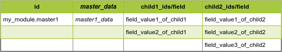
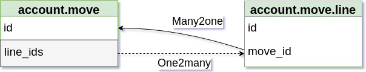
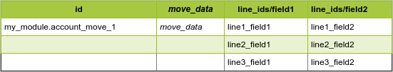

Odoo CSV Import Export Library
==============================
This library provides tools to easily and quickly import data into Odoo or export data from Odoo using CSV file. 
It also provide a framework to manipulate data from CSV.

- [Odoo CSV Import Export Library](#odoo-csv-import-export-library)
- [Installation](#installation)
- [Importing Data](#importing-data)
  - [Import Parameters](#import-parameters)
    - [--config CONFIG](#config-config)
    - [--file FILENAME](#file-filename)
    - [--sep SEPARATOR](#sep-separator)
    - [--skip LINE](#skip-line)
    - [--model MODEL](#model-model)
    - [--size BATCH_SIZE](#size-batchsize)
    - [--worker WORKER](#worker-worker)
    - [--groupby SPLIT](#groupby-split)
    - [--ignore IGNORE](#ignore-ignore)
    - [--context CONTEXT](#context-context)
      - [Import Related Keys](#import-related-keys)
      - [ORM and Performance Related Keys](#orm-and-performance-related-keys)
      - [Model Specific Keys](#model-specific-keys)
    - [--o2m](#o2m)
    - [--check](#check)
    - [--fail](#fail)
  - [Using the Script](#using-the-script)
  - [Transformations](#transformations)
    - [Basic Concepts](#basic-concepts)
      - [A Simple Partner Import](#a-simple-partner-import)
      - [Dealing with Relationships](#dealing-with-relationships)
        - [Many2one Relationships](#many2one-relationships)
        - [One2many Relationships](#one2many-relationships)
        - [Many2many Relationships](#many2many-relationships)
      - [Controlling the Load sequence](#controlling-the-load-sequence)
    - [Mapper Functions](#mapper-functions)
      - [mapper.const(value)](#mapperconstvalue)
      - [mapper.val(field, default='', postprocess=lambda x: x, skip=False)](#mappervalfield-default-postprocesslambda-x-x-skipfalse)
      - [mapper.map_val(field, mapping, default='')](#mappermapvalfield-mapping-default)
      - [mapper.num(field, default='0.0')](#mappernumfield-default00)
      - [mapper.bool_val(field, true_vals=[], false_vals=[])](#mapperboolvalfield-truevals-falsevals)
      - [mapper.binary(field, path_prefix, skip=False, encoding="utf-8")](#mapperbinaryfield-pathprefix-skipfalse-encoding%22utf-8%22)
      - [mapper.concat(separator, *fields)](#mapperconcatseparator-fields)
      - [mapper.m2o(PREFIX, field, default='', skip=False)](#mapperm2oprefix-field-default-skipfalse)
      - [mapper.m2o_map(PREFIX, mapper, default='', skip=False)](#mapperm2omapprefix-mapper-default-skipfalse)
      - [mapper.m2m(PREFIX, *fields)](#mapperm2mprefix-fields)
      - [mapper.m2m_id_list(PREFIX, *args, **kwargs)](#mapperm2midlistprefix-args-kwargs)
      - [mapper.m2m_value_list(*args, **kwargs)](#mapperm2mvaluelistargs-kwargs)
    - [Advanced Transformations](#advanced-transformations)
      - [User Defined Mappers](#user-defined-mappers)
      - [Managing the Client CSV file](#managing-the-client-csv-file)
        - [Adding a column](#adding-a-column)
        - [Removing Lines](#removing-lines)
      - [Updating Records With Database IDs](#updating-records-with-database-ids)
  - [A Real Life Example](#a-real-life-example)
  - [Performances Considerations](#performances-considerations)
    - [Importing Related or Computed Fields](#importing-related-or-computed-fields)
  - [Troubleshooting](#troubleshooting)
    - [When the number of records does not match](#when-the-number-of-records-does-not-match)
  - [Tips and Tricks](#tips-and-tricks)
    - [Importing Data of Multiple Companies](#importing-data-of-multiple-companies)
    - [Importing Translations](#importing-translations)
    - [Importing Account Move Lines](#importing-account-move-lines)
- [Exporting Data](#exporting-data)
- [Requirements](#requirements)

# Installation
* From GitHub

```
git clone git@github.com:tfrancoi/odoo_csv_import.git
```

* From PyPi

```
[sudo] pip install odoo_import_export_client
```
# Importing Data
The Odoo CSV Import Export library provides the script `odoo_import_thread.py` to import data into Odoo. The script is designed to load one data file into one model. That means you might need to run the script several times with different data files, models and other options to complete an import.

<p align=center></p>

Data are not inserted directly into the database, instead they are loaded by calling the method `models.load`. Doing so, the standard behaviour of each model is respected.

This script has several options. Type the command `odoo_import_thread.py --help` to get the usage.

```
usage: odoo_import_thread.py [-h] -c CONFIG --file FILENAME --model MODEL
                             [--worker WORKER] [--size BATCH_SIZE]
                             [--skip SKIP] [--fail] [-s SEPARATOR]
                             [--groupby SPLIT] [--ignore IGNORE] [--check]
                             [--context CONTEXT] [--o2m]

Import data in batch and in parallel

optional arguments:
  -h, --help            show this help message and exit
  -c CONFIG, --config CONFIG
                        Configuration File that contains connection parameters
  --file FILENAME       File to import
  --model MODEL         Model to import
  --worker WORKER       Number of simultaneous connection
  --size BATCH_SIZE     Number of line to import per connection
  --skip SKIP           Skip until line [SKIP]
  --fail                Fail mode
  -s SEPARATOR, --sep SEPARATOR
                        CSV separator
  --groupby SPLIT       Group data per batch with the same value for the given
                        column in order to avoid concurrent update error
  --ignore IGNORE       list of column separate by comma. Those column will be
                        remove from the import request
  --check               Check if record are imported after each batch.
  --context CONTEXT     context that will be passed to the load function, need
                        to be a valid python dict
  --o2m                 When you want to import o2m field, don't cut the batch
                        until we find a new id
```
One of the most important feature is the ability to import in parallel while controlling the transaction size.
These options allow to import huge data files while dealing with performance, what is not possible with the builtin Odoo import wizard.

Here is how looks like a typical execution of the script:

<p align=center></p>

<p align=center><i>The parameter values are set for illustrating purposes.</i></p>

When running the script, an amount of threads are spawned. Each of them handles an amount of records by transaction. Each transaction inserts or updates records in the Odoo instance defined in the configuration file.

## Import Parameters

### --config CONFIG
The configuration file `CONFIG` is a text file that defines the parameters used in the import. Here is an example.

```
[Connection]
hostname = mydb.odoo.com
database = mydb
login = admin
password = admin
protocol = jsonrpcs
port = 443
uid = 2
```
The section `[connection]` is mandatory. Then the following parameters must be set accordingly.
<table>
    <tr><td><b>Parameter</b></td><td><b>Description</b></td></tr>
    <tr>
        <td>
        hostname
        </td>
        <td>
        Name of the host where the Odoo resides.
        </td>
    </tr>
    <tr>
        <td>
        database
        </td>
        <td>
        Name of the Postgresql database.
        </td>
    </tr>
    <tr>
        <td>
        login
        </td>
        <td>
        The login used to create or update the records.
        </td>
    </tr>
    <tr>
        <td>
        password
        </td>
        <td>
        The login's password.
        </td>
    </tr>
    <tr>
        <td>
        protocol
        </td>
        <td>
        Protocol used for RPC calls. It can be one of the following values: <b>xmlrpc</b>, <b>xmlrpcs</b>, <b>jsonrpc</b>, <b>jsonrpcs</b>.<br>
        For a remote database, it's strongly advised to used an encrypted protocol (xmlrcps or jsonrpcs). 
        </td>
    </tr>
    <tr>
        <td>
        port
        </td>
        <td>
        TCP port where Odoo can be reached. Usually 443 for encrypted remote connections, or 8069 for a local Odoo with its default configuration.
        </td>
    </tr>
    <tr>
        <td>
        uid
        </td>
        <td>
        This is the database id of the res.user identified by the parameter 'login'.<br>
        Well known ids are: <br>
        1 = admin user prior to V12.<br>
        2 = admin user as of V12.
        </td>
    </tr>
</table>

> **Tips:** On premise, it's advised to use a dedicated user with the minimal access rights on all the models related to the import.

By default, `CONFIG` is set to `conf/connection.conf`. Under windows, you must always set this option because the path separator is not compliant with the OS.

### --file FILENAME
Define the CSV `FILENAME` to import. The CSV format is mandatory. In order to be importable in Odoo, this file must follow some rules:
- The file must be in UTF-8 encoding.
- One file must contain data of only one model.
- The first line is the column names. All columns must have the technical name of the fields.
- All lines must have an `id` column fullfilled with an XML_ID that identifies the record.
- Some field formats must be respected: 
  - Boolean values must be 0 or 1.
  - Binary data must be encoded in base64.
  - Datetime fields format depends on the language (often %Y-%m-%d %H:%M:%S).
  - The decimal separator of float values also depends on the language (often '.').
  - Selection fields must always contain database values.
  - Many2one fields must be suffixed with `/id` if their value is an XML_ID or `.id` if it's a database id.
  - Many2many fields must be a comma separated list of XML_IDs.
- If a field value is splitted into multiple lines, it must be enclosed with double quotes (").

The fields separator can be set with the option `--sep SEPARATOR`.

You can skip the first lines of the file with the option `--skip LINE`.

The name of the CSV file can be used to set the model by default. Ex: the file name `res_partner.csv` sets the model to `res.partner`. See the `--model` option for more detail.

### --sep SEPARATOR
Define the column separator. Ex: `--sep=,`. By default, it's the semicolon (;).

If the separator is present in a field value, the value must be enclosed with double quotes (").

### --skip LINE
Allow to skip the first `LINE`line(s) of the file. Ex: `--skip=3` will skip the first three lines.

The first line must be the column names. Don't skip any line if it's the case.

### --model MODEL
Set the `MODEL` to import data into. Ex: `--model=res.partner`.

By default the model is the name of the CSV file with the underscores (_) replaced by dots (.) and without extension. Meaning, if the CSV file is named`res_partner.csv`, the model is `res.partner` by default .

### --size BATCH_SIZE
Controls the number of records (`BATCH_SIZE`) imported in one transaction.

When using the standard import wizard of Odoo, an import is always handled by one worker in one single transaction for the whole file.

<p align=center></p>

When dealing with big data files, this may lead to two main issues:
- the time needed to import the whole file could exceed the maximum time allowed for a transaction to run. This time is set by the Odoo parameters `limit-time-cpu` and `limit-time-real`,
- if an error occurs on one record, the whole transaction fails and all the records are rejected.

The solution is then to reduce the number of records in one transaction by setting the `--size` parameter to the desired number.

<p align=center></p>

Here colored in blue, the transaction contains two records (`--size=2`). Now, only two records instead of the whole file must be imported during the time allocated for the transaction.

This option is also helpful when importing large records over a WAN connection because a smaller transaction size leads to smaller JSON or XML payloads to send over the network. However it causes a bit more network overhead which could slow down the total run time. This run time can be drastically decreased by using the `--worker` parameter.

### --worker WORKER
Controls the number of import threads in parallel.

Here is how a import looks like whith `--worker=2`.

<p align=center></p>

The whole file is now handled by two workers in parallel. The total run time is then divided by two. 

As a rule of thumb, you can set the number of workers up to 80% of the number Odoo workers. So that other users can still work while the import runs.

When working with multiple workers, there is a potential drawback: the concurrent updates.

In the following example, suppose Import Thread 1 is importing my_partner_2 while Import Thread 2 is importing my_partner_3.

<p align=center></p>

Both partners have the same parent_id: my_partner_1. As the `parent_id` is a related field non readonly, the insert/update of my_partner_2 and my_partner_3 will both trigger an update on my_partner_1. That's a concurrent update. As a consequence the current transaction of both threads will fail. To solve such an issue, the parameter `--groupby` can be used.

### --groupby SPLIT
Selects the field to group in one thread.

To avoid the concurrent update issue described previously, you can use `--groupby=parent_id/id`. By doing this, we ensure all the records with the same `parent_id/id` are imported by the same thread. It thus eliminates the concurrent updates **caused by the parent_id**.

<p align=center></p>

### --ignore IGNORE
Specifies the columns that do not need to be imported. Multiple columns can be set in a comma separated list. Ex: `--ignore=col1,col2,col3`.

This is typically used to avoid cascade updates while importing related fields. Refer to [Importing Related or Computed fields](#Importing-Related-or-Computed-Fields).

### --context CONTEXT
Define the context of the ORM while importing. Ex:`--context="{'tracking_disable': True}"`.

Here are some useful context keys.

#### Import Related Keys

<table>
    <tr><td><b>Key</b></td><td><b>Description</b></td></tr>
    <tr>
        <td>
        write_metadata
        </td>
        <td>
        When True, allow to import audit log fields (create_uid, create_date, write_uid, write_date). The import must run with the `admin` user. Requires the module <strong>import_metadata</strong> available <a href=https://github.com/tfrancoi/easier_import/tree/11.0>here</a>.
        </td>
    </tr>
    <tr>
        <td>
        update_many2many
        </td>
        <td>
        Set it to True when the data file contains a many2many relationship splitted as one record per line instead of a comma separated list of XML_IDs in one column. Suppose we want to assign categories to products, a regular record is:<br>
        product1;categ1,categ2,categ3<br>
        With 'update_many2many': True, you can import  a file with the following structure:<br>
        product1;categ1<br>
        product1;categ2<br>
        product1;categ3<br>
        </td>
    </tr>
</table>

#### ORM and Performance Related Keys

<table>
    <tr><td><b>Key</b></td><td><b>Description</b></td></tr>
    <tr>
        <td>
        tracking_disable
        </td>
        <td>
        When True, don't create messages in the chatter
        </td>
    </tr>
    <tr>
        <td>
        defer_fields_computation
        </td>
        <td>
        When True, recompute the computed fields at the end of the transaction instead of after each record. Useless if --size=1. Requires the module <strong>defer_fields_computation</strong> available <a href=https://github.com/jad-odoo/easier_import/tree/12.0>here</a>.
        </td>
    </tr>
    <tr>
        <td>
        defer_parent_store_computation
        </td>
        <td>
        Defer the computation of the fields parent_left and parent_right at the end of the transaction.
        Valid up to Odoo 11.
        </td>
    </tr>
    <tr>
        <td>
        lang
        </td>
        <td>
        Set the current language. Ex: 'lang': fr_FR
        </td>
    </tr>
    <tr>
        <td>
        force_company
        </td>
        <td>
        Set the current company. Use the database identifier of the company.
        </td>
    </tr>
</table>

#### Model Specific Keys

<table>
    <tr><td><b>Key</b></td><td><b>Description</b></td></tr>
    <tr>
        <td>
        check_move_validity
        </td>
        <td>
        Set it to False when you import account moves and account move lines. Refer to "Importing Account Move Lines" for more details.
        </td>
    </tr>
    <tr>
        <td>
        create_product_product
        </td>
        <td>
        Set it to True when you import product templates and also the variants. Without this key, the ORM will automatically create the variants when the templates are imported.
        </td>
    </tr>
</table>

These are some examples. Feel free to look into <a href=https://github.com/odoo/odoo>Odoo code</a> to find out all context keys.

### --o2m
Use this option when you import a data file with one2many relationships. The import file must follow a specific structure.

<p align=center></p>

Suppose the model `master` has two one2many fields `child1_ids` and `child2_ids`, linking respectively the models `child1` and `child2`.
In the line beginning a master record, you can set all the master fields, like a regular import file. In addition, you can add the fields of child records. In the next lines, you can add the data of the next childs, leaving empty the columns of the master record and the unexisting childs.

With the `--o2m` option, the master record will be imported with its two `child1` and its three `child2` in the same time.
It worths noticing that it's impossible to set XML_IDs on the child records. As a consequence:
- you cannot run the import again to update the childs data,
- the childs cannot be referenced in another import file.


### --check
With this option, at the end of each transaction, the number of records in the transaction is compared to the number of imported records. If these numbers do not match, an error message is printed. Most likely, the transaction contains records with duplicate XML_IDs. Refer to [When the number of records does not match](#when-the-number-of-records-does-not-match) for more explanations.

### --fail
Engage the fail mode.

When you run `odoo_import_thread.py` whithout the `--fail` option, it runs in _normal_ mode. In this mode, any rejected record is printed in a file with the same name as the parameter `--file` suffixed by `.fail` and located in the same folder.

This `.fail` file may contain records rejected for good reasons (ie. a required field is missing) or _bad_ reasons. If you run an import with multiple workers, a bad reason could be a concurrent update. And even in a single thread, when an error occurs in one record, all the records of the transaction (`--size`) are rejected.
This means the `.fail` file may contain records that could be imported if the process had run by a single thread and in a specific transaction for each record. That's the role of the fail mode.

<p align=center></p>

In fail mode, `odoo_import_thread.py` will try to import the records of the `.fail` file. Additionaly,  neither `--worker` nor `--size` is set. The default values of `1` are then used to ensure a single thread and a single record per transaction.

In this mode, the rejected records are placed in the `.fail.bis` file in the same folder. This file contains only rejections that need your attention and must be solved before importing again.

## Using the Script
To use all the benefits of the script, most of the time imports are run with multiple workers and a user defined transaction size. In this case and because of the fail mode, you always need two command lines to import one file.

Assuming:
- your configuration file is `connection.conf` located in the current folder,
- your data file is `my_data.csv` located in the current folder,
- the target model is `my.model`,
- you want to run a fast multithreaded import.

Run the following two commands (as an example):
```
odoo_import_thread.py -c connection.conf --file=my_data.csv --model=my.model --worker=4 --size=200 [other options]
odoo_import_thread.py -c connection.conf --file=my_data.csv --model=my.model --fail [other options]
```

The first command runs the import in parallel and in batch. The rejected records are printed in the file `my_data.csv.fail`. We don't care about this file, it will be handled in the next command.

In the second command, the parameter `--fail` replaces `--worker` and `--size`. The import runs in fail mode. It will read `my_data.csv.fail` (note the parameter `--file` is unchanged) and print the rejected records in the file  `my_data.csv.fail.bis`. If the `.fail.bis` file empty, all the records are imported (inserted or updated).

Refer to the [Troubleshooting](#troubleshooting) section to know how to solve some issues.

## Transformations

When the file to import doesn't respect the [expected format](#file-FILENAME) of `odoo_import_thread.py`, it's necessary to apply some transformations in order to create compliant CSV files. The Odoo CSV Import Export library helps in creating a python script able to transform CSV files thanks to the `Processor` and the `mapper` objects.

<p align=center></p>

### Basic Concepts

Let's start with a simple use case to introduce the main concepts of the tranformations. Once you're familiar with, a more complete use case is provided [here](#a-real-life-example). 

#### A Simple Partner Import
A customer wants to import some partners. He provides the following CSV file, say `client_file.csv`:

```
Firstname;Lastname;Birthdate
John;Doe;31/12/1980
David;Smith;28/02/1985
```
This file cannot be imported directly because:
- the fields `Lastname`, `Firstname`, `Birthdate` do not exist in the model `res.partner`,
- the date format is not compliant,
- there is no `id` field.

The first step to do is to ensure that all the fields exist in the target model. Here, the birthdate is a new data. We assume it must be stored in the field `birthdate` created before the import. Instead, `Firstname` and  `Lastname` will be used as the `name`of the partner.

Now the transformation step can begin. It consists on writing a python script that builds another CSV file compliant with the model `res.partner`, this is our Odoo CSV file.
In this case, the transformation steps will:
- define how we build the `name` field from the columns `Lastname` and `Firstname`,
- change the date format to a compliant one.

Another important point to consider is what happens when we load the data several times (*it could occur if the tranformations must be rewritten*). Basically, when we import the Odoo CSV file the first time, the two partners will be created. But if we run it again, we don't want to create duplicates. Instead, we want to update the partner information. So the transformation phase is also necessary to:

- assign an XML_ID to each partner of the file.

The presence of an XML_ID ensures that a record is created if it doesn't exist, or updated if it already exists. This behaviour is included in the method `load` of each Odoo model. 

Let's build the transformation script, say `res_partner.py`. We start with importing the needed objects from the library.

```
# -*- coding: utf-8 -*-
from odoo_csv_tools.lib import mapper
from odoo_csv_tools.lib.transform import Processor

# Custom import
from datetime import datetime   # used to change the format of datetime fields
```

Then we build a `Processor` object from the client CSV file `client_file.csv`. Assuming this file resides in the current folder:

```
processor = Processor('client_file.csv', delimiter=';')
```

Now we create a mapping dictionary where the keys are the fields of the target model (`res.partner`) we want to import -**at least the required fields without default value**- and how we get them from the client file.

```
res_partner_mapping = {    
    'id': mapper.m2o_map('my_import_res_partner', mapper.concat('_', 'Firstname', 'Lastname', 'Birthdate')),
    'name: mapper.concat(' ','Firstname','Lastname'),
    'birthdate': mapper.val('Birthdate', postprocess=lambda x: datetime.strptime(x, "%d/%m/%y").strftime("%Y-%m-%d 00:00:00")),
}
```
All the fields are extracted with the methods of the `mapper` object. These are described [here](#mapper-functions).

An important thing to notice is the `id` field. It is mandatory by the script `odoo_import_thread.py`. It contains an XML_ID that we build *as we want* as soon as its unicity is garanteed. In this example, we assume the concatenation of three columns (`Lastname`, `Firstname` and `Birthdate`) is enough to identify a record. It will create XML_IDs like `my_import_res_partner.John_Doe_31/12/1980` in the Odoo CSV file. You are free to choose whatever module name you want, here `my_import_res_partner`, but it's a good idea to include the model name and something like the *project* name.

Now we can invoke the transformation by itself.

```
processor.process(res_partner_mapping, 'res.partner.csv', {'model': 'res.partner', 'context': "{'tracking_disable': True}", 'worker': 2, 'batch_size': 20})
```
This step will create the import file `res.partner.csv` for the model. `res.partner`. It should look like this, conforming to `res_partner_mapping`:

```
id;name;birthdate
my_import_res_partner.John_Doe_31/12/1980;John Doe;31-12-1980 00:00:00
my_import_res_partner.David_Smith_28/02/1985;David Smith;28-02-1985 00:00:00
```
> **Note:** The order of the columns is not related to the client file or the keys in the transform mapping dictionary.

Notice some options are set when invoking the transformation: `'context': "{'tracking_disable': True}", 'worker': 2, 'batch_size': 20}`. 
They don't play any role in the transformation by itself. Instead it will be used by the import shell script later. Hopefully, we can automatically create the shell script by adding this line:

```
processor.write_to_file("res_partner.sh", python_exe='', path='')
```

This will create the script `res_partner.sh` that will load the data with `odoo_import_thread.py`, first in normal mode, then in fail mode. It looks like this:

```
odoo_import_thread.py -c conf/connection.conf --file=res.partner.csv --model=res.partner --worker=2 --size=20 --groupby= --ignore= --sep=";" --context="{'tracking_disable': True}"
odoo_import_thread.py -c conf/connection.conf --fail --file=res.partner.csv --model=res.partner --ignore= --sep=";" --context="{'tracking_disable': True}"
```

<u>The complete python script:</u>
```
# -*- coding: utf-8 -*-
from odoo_csv_tools.lib import mapper
from odoo_csv_tools.lib.transform import Processor

# Custom import
from datetime import datetime   # used to change the format of datetime fields

processor = Processor('client_file.csv', delimiter=';')

res_partner_mapping = {    
    'id': mapper.m2o_map('my_import_res_partner', mapper.concat('_', 'Firstname', 'Lastname', 'Birthdate')),
    'name: mapper.concat(' ','Firstname','Lastname'),
    'birthdate': mapper.val('Birthdate', postprocess=lambda x: datetime.strptime(x, "%d/%m/%y").strftime("%Y-%m-%d 00:00:00")),
}

processor.process(res_partner_mapping, 'res.partner.csv', {'model': 'res.partner', 'context': "{'tracking_disable': True}", 'worker': 2, 'batch_size': 20})
processor.write_to_file("res_partner.sh", python_exe='', path='')
```

<u>Run the transformations</u>

```
python res_partner.py
```

You should have created:
-  the import file `res.partner.csv` in the same folder as the client file `res_partner.csv`, 
-  the shell script `res_partner.sh` in your current folder.

#### Dealing with Relationships

##### Many2one Relationships

Coming back to our simple example, let's suppose the client adds the partner's company in his data. Here, we are not in a multi companies environment,  the company is just the partner's parent. The file could look like this:
```
Company;Firstname;Lastname;Birthdate
The World Company;John;Doe;31/12/1980
The Famous Company;David;Smith;28/02/1985
```
In this case we must import four partners (the two companies and the two persons) and set the field `parent_id` of the two persons to their respective company. In a relational database we link records thanks to their internal identifiers (`id`). But at this step, these ids are unknown because the records are not imported yet. We will then use the XML_IDs to link the records.

It means when we transform a company, we assign an XML_ID to it, then we use this XML_ID as the `parent_id` of the person who is a member of this company. As a consequence the companies must be imported before the persons. More precisely, the XML_IDs set in the `parent_id` must exist before being used as a relationship value.

Let's create the transformation script. As usual, we start with the needed imports and the creation of a `Processor` on the client file.
```
# -*- coding: utf-8 -*-
from odoo_csv_tools.lib import mapper
from odoo_csv_tools.lib.transform import Processor
from datetime import datetime   # used to change the format of datetime fields

processor = Processor('client_file.csv', delimiter=';')
```

Now we can define the mapping to extract the companies. These are records in the model `res.partner` with the boolean field `is_company` set. We also assume the company name is unique so that we can use it as an identifier in the XML_ID.
```
res_partner_company_mapping =  {
    'id': mapper.m2o_map('my_import_res_partner', mapper.val('Company')),
    'name': mapper.val('Company'),
    'is_company': mapper.const('1'),
}

processor.process(res_partner_company_mapping, 'res.partner.company.csv', {}, 'set')
```
It worths noting the option`'set'` of `processor.process` while invoking the companies transformation. This option allows to remove duplicates in the Odoo CSV file. It could be the case if several partners belong to the same company.

And here is the mapping to extract the persons. It's exactly the same as before except we've added the field `parent_id`.
```
res_partner_mapping = {    
    'id': mapper.m2o_map('my_import_res_partner', mapper.concat('_', 'Firstname', 'Lastname', 'Birthdate')),
    'name': mapper.concat(' ','Firstname','Lastname'),
    'birthdate': mapper.val('Birthdate', postprocess=lambda x: datetime.strptime(x, "%d/%m/%y").strftime("%Y-%m-%d 00:00:00")),
    'parent_id/id': mapper.m2o_map('my_import_res_partner', mapper.val('Company')),
}

processor.process(res_partner_mapping, 'res.partner.csv', {})
```
The important thing to notice here is that we use exactly the same transformation method for the partner ids in both mappings in order to generate the same XML_ID (`res_partner_mapping['parent_id/id']` = `res_partner_company_mapping['id']`). *Remember also the suffix `/id` when using XML_IDs in relation fields.*

The results will be two differents Odoo CSV files:

- The partners who are companies: `res.partner.company.csv`.
```
id;name;is_company
my_import_res_partner.The World Company;The World Company;1
my_import_res_partner.The Famous Company;The Famous Company;1
```

- The persons: `res.partner.csv` where the column `partner_id/id` refer to an existing `id` in `res.partner.company.csv`.
```
id;parent_id/id;name;birthdate
my_import_res_partner.John_Doe_31/12/1980;my_import_res_partner.The World Company;John Doe;31-12-1980 00:00:00
my_import_res_partner.David_Smith_28/02/1985;my_import_res_partner.The Famous Company;David Smith;28-02-1985 00:00:00
```

Finally we generate the shell script that will load the files by adding this line in the transformation script.

```
processor.write_to_file("res_partner.sh", python_exe='', path='')
```

This will create the shell script `res_partner.sh` that will load the data. It looks like this:

```
odoo_import_thread.py -c conf/connection.conf --file=res.partner.company.csv --model=res.partner --groupby= --ignore= --sep=";" --context="{}"
odoo_import_thread.py -c conf/connection.conf --fail --file=res.partner.company.csv --model=res.partner --ignore= --sep=";" --context="{}"

odoo_import_thread.py -c conf/connection.conf --file=res.partner.csv --model=res.partner --groupby= --ignore= --sep=";" --context="{}"
odoo_import_thread.py -c conf/connection.conf --fail --file=res.partner.csv --model=res.partner --ignore= --sep=";" --context="{}"
```
The script contains all the commands to load both Odoo CSV files. They are written in the same order as in the transformation script. So the import sequence is respected.

<u>The complete python script:</u>
```
# -*- coding: utf-8 -*-
from odoo_csv_tools.lib import mapper
from odoo_csv_tools.lib.transform import Processor
from datetime import datetime   # used to change the format of datetime fields

processor = Processor('client_file.csv', delimiter=';')

res_partner_company_mapping =  {
    'id': mapper.m2o_map('my_import_res_partner', mapper.val('Company')),
    'name': mapper.val('Company'),
    'is_company': mapper.const('1'),
}

processor.process(res_partner_company_mapping, 'res.partner.company.csv', {}, 'set')

res_partner_mapping = {    
    'id': mapper.m2o_map('my_import_res_partner', mapper.concat('_', 'Firstname', 'Lastname', 'Birthdate')),
    'name': mapper.concat(' ','Firstname','Lastname'),
    'birthdate': mapper.val('Birthdate', postprocess=lambda x: datetime.strptime(x, "%d/%m/%y").strftime("%Y-%m-%d 00:00:00")),
    'parent_id/id': mapper.m2o_map('my_import_res_partner', mapper.val('Company')),
}

processor.process(res_partner_mapping, 'res.partner.csv', {})

processor.write_to_file("res_partner.sh", python_exe='', path='')
```


##### One2many Relationships

Usually we don't import `One2many` fields. Instead, we import the inverse `Many2one` relation in the linked model. 

##### Many2many Relationships

Let's suppose our customer adds some categories to the partners. The client file could look like this:
```
Company;Firstname;Lastname;Birthdate;Category
The World Company;John;Doe;31/12/1980;Premium
The Famous Company;David;Smith;28/02/1985;Normal,Bad Payer
```
The categories are set in one column in the same line of the partner record and separated with a comma.

By looking into Odoo, we see that the model `res.partner` contains a field `category_id` which is a Many2many to the model `res.partner.category`. If you remember the rule _Many2many fields must be a comma separated list of XML_IDs_ and that an XML_ID must be created before being used in a relationship, you get an idea of the procedure to apply.

1- Create all the categories by extracting them from the client file and assign them and XML_ID.

2- Build a comma separated list of XML_IDs of categories for each partner. 

Let's start the transformation script. As usual, we start with the needed imports and the creation of a `Processor` on the client file.
```
# -*- coding: utf-8 -*-
from odoo_csv_tools.lib import mapper
from odoo_csv_tools.lib.transform import Processor
from datetime import datetime   # used to change the format of datetime fields

processor = Processor('client_file.csv', delimiter=';')
```

The first transformation extracts the categories. We assume the name is unique to create the XML_IDs.
```
partner_category_mapping = {
   'id': mapper.m2m_id_list('res_partner_category', 'Category'),
   'name':  mapper.m2m_value_list('Category'),
}

processor.process(partner_category_mapping, 'res.partner.category.csv', {}, m2m=True)
```
Notice we use two mapper functions to deal with Many2many relationships: `m2m_id_list` and `m2m_value_list`, and the option `m2m=True` in the `processor.process`command.

This will create the file `res.partner.category.csv` with all the unique categories as follow:
```
id;name
res_partner_category.Premium;Premium
res_partner_category.Normal;Normal
res_partner_category.Bad Payer;Bad Payer
```

Now we can complete the person mapping. It's exactly the same as before except we have added the field `category_id`.
 
```
res_partner_mapping = {    
    'id': mapper.m2o_map('my_import_res_partner', mapper.concat('_', 'Firstname', 'Lastname', 'Birthdate')),
    'name': mapper.concat(' ','Firstname','Lastname'),
    'birthdate': mapper.val('Birthdate', postprocess=lambda x: datetime.strptime(x, "%d/%m/%y").strftime("%Y-%m-%d 00:00:00")),
    'parent_id/id': mapper.m2o_map('my_import_res_partner', mapper.val('Company')),
    'category_id/id': mapper.m2m('res_partner_category', 'Category'),
}

processor.process(res_partner_mapping, 'res.partner.csv', {})
```
The important thing here is to use the same XML_ID `'res_partner_category' + Category'` for both
`res_partner_mapping[category_id/id] = mapper.m2m` and `partner_category_mapping[id] = mapper.m2m_id_list`.

 The mapping `res_partner_mapping` will create a new file `res.partner.csv` like this:
```
id;parent_id/id;name;birthdate;category_id/id
my_import_res_partner.John_Doe_31/12/1980;my_import_res_partner.The World Company;John Doe;31-12-1980 00:00:00;res_partner_category.Premium
my_import_res_partner.David_Smith_28/02/1985;my_import_res_partner.The Famous Company;David Smith;28-02-1985 00:00:00;res_partner_category.Normal,res_partner_category.Bad Payer
```
Notice the column `category_id/id` that contains a comma separated list of XML_IDs of partner categories.

Finally we create the load script by adding this line:
```
processor.write_to_file("res_partner.sh", python_exe='', path='')
```
It creates the script `res_partner.sh` looking like this:
```
odoo_import_thread.py -c conf/connection.conf --file=res.partner.category.csv --model=res.partner.category --groupby= --ignore= --sep=";" --context="{}"
odoo_import_thread.py -c conf/connection.conf --fail --file=res.partner.category.csv --model=res.partner.category --ignore= --sep=";" --context="{}"

odoo_import_thread.py -c conf/connection.conf --file=res.partner.csv --model=res.partner --groupby= --ignore= --sep=";" --context="{}"
odoo_import_thread.py -c conf/connection.conf --fail --file=res.partner.csv --model=res.partner --ignore= --sep=";" --context="{}"
```

<u>The complete python script:</u>
```
# -*- coding: utf-8 -*-
from odoo_csv_tools.lib import mapper
from odoo_csv_tools.lib.transform import Processor
from datetime import datetime   # used to change the format of datetime fields

processor = Processor('client_file.csv', delimiter=';')

partner_category_mapping = {
   'id': mapper.m2m_id_list('res_partner_category', 'Category'),
   'name':  mapper.m2m_value_list('Category'),
}

processor.process(partner_category_mapping, 'res.partner.category.csv', {}, m2m=True)

res_partner_mapping = {    
    'id': mapper.m2o_map('my_import_res_partner', mapper.concat('_', 'Firstname', 'Lastname', 'Birthdate')),
    'name': mapper.concat(' ','Firstname','Lastname'),
    'birthdate': mapper.val('Birthdate', postprocess=lambda x: datetime.strptime(x, "%d/%m/%y").strftime("%Y-%m-%d 00:00:00")),
    'parent_id/id': mapper.m2o_map('my_import_res_partner', mapper.val('Company')),
    'category_id/id': mapper.m2m('res_partner_category', 'Category'),
}

processor.process(res_partner_mapping, 'res.partner.csv', {})

processor.write_to_file("res_partner.sh", python_exe='', path='')
```

> **Note:** it's possible to import many2many relationships with another file structure. Refer to the context key [update_many2many](#import-related-keys) to learn how.


#### Controlling the Load sequence
The load order in the shell script depends on the order of the `processor.process` instructions in the transformation script.

This example script:
```
processor = Processor('client_file.csv', delimiter=';')

res_partner_company_mapping =  {
}

res_partner_mapping = {    
}

processor.process(res_partner_company_mapping, 'res.partner.company.csv', {}, 'set')
processor.process(res_partner_mapping, 'res.partner.csv', {})
processor.write_to_file("res_partner.sh", python_exe='', path='')
```
will create the load script `res_partner.sh` with:

1- the load of `res.partner.company.csv` because it's the first invoked transformation,

2- the load of `res.partner.csv`.

If you want to import the persons first (which is a bad idea here), just inverse the two `processor.process` commands.
```
processor = Processor('client_file.csv', delimiter=';')

res_partner_company_mapping =  {
}

res_partner_mapping = {    
}

processor.process(res_partner_mapping, 'res.partner.csv', {})
processor.process(res_partner_company_mapping, 'res.partner.company.csv', {}, 'set')
processor.write_to_file("res_partner.sh", python_exe='', path='')
```

Now if you want to create two separated shell scripts, one for companies and another for the persons, you need to create a new `Processor`.
```
#For the 1st load script
processor = Processor('client_file.csv', delimiter=';')
res_partner_company_mapping =  {
}
processor.process(res_partner_company_mapping, 'res.partner.company.csv', {}, 'set')
processor.write_to_file("res_partner_company.sh", python_exe='', path='')

#For the 2nd load script
processor = Processor('client_file.csv', delimiter=';')
res_partner_mapping = {    
}
processor.process(res_partner_mapping, 'res.partner.csv', {})
processor.write_to_file("res_partner.sh", python_exe='', path='')
```
This will create the script `res_partner_company.sh` that loads only `res.partner.company.csv`, and the script `res_partner.sh` that loads only `res.partner.csv`. It can be useful if you need to do something between importing the companies and the persons (ie. to call another load or RPC calls). The drawback is that the client file is read twice.

### Mapper Functions
You can get the value of columns in the client file with several methods defined in the `mapper` object. Take a look at `lib/mapper.py` to get an up to date list of methods. Here are the most commonly used.

#### mapper.const(value)
Use it to assign always the same value to a field.

<table>
    <tr><td><b>Client File</b></td><td><b>Mapper</b></td><td><b>Import File</b></td></tr>
    <tr>
        <td>
            <b>my_column</b><br>
            my_value1<br>
            my_value2
        </td>
        <td>
            {<br>
            'my_field': mapper.<b>const('forced_value')</b>,<br>
            }<br>
        </td>
        <td>
            <b>my_field</b><br>
            forced_value<br>
            forced_value
        </td>
    </tr>
</table>

Example: setting a company missing in the client file:
```
fields_mapping = {
    ...
    'company_id/id': mapper.const('base.main_company'),
    ...
}
```

#### mapper.val(field, default='', postprocess=lambda x: x, skip=False)

Takes the value of the column. Use it for a `Char` or `Text` field.

<table>
    <tr><td><b>Client File</b></td><td><b>Mapper</b></td><td><b>Import File</b></td></tr>
    <tr>
        <td>
            <b>my_column</b><br>
            my_value1<br>
            my_value2
        </td>
        <td>
            {<br>
            'my_field': mapper.<b>val('my_column')</b>,<br>
            }<br>
        </td>
        <td>
            <b>my_field</b><br>
            my_value1<br>
            my_value2
        </td>
    </tr>
</table>

#### mapper.map_val(field, mapping, default='')
Takes the value from a dictionary where the key is the value of the column.

<table>
    <tr><td><b>Client File</b></td><td><b>Mapper</b></td><td><b>Import File</b></td></tr>
    <tr>
        <td>
            <b>my_column</b><br>
            key1<br>
            key2
        </td>
        <td>
            mapping = {<br>
            'key1': 'value1',<br>
            'key2': 'value2'<br>
            }<br><br>
            {<br>
            'my_field': mapper.<b>map_val('my_column', mapping)</b>,<br>
            }<br>
        </td>
        <td>
            <b>my_field</b><br>
            value1<br>
            value2
        </td>
    </tr>
</table>

Example: setting a country.

```
Country_column;
BE;
FR;
```

```
country_map = {
    'BE': 'base.be',
    'FR': 'base.fr',
}

fields_mapping = {
    ...
    'country_id/id': mapper.map_val('Country_column', country_map),
    ...
}
```

#### mapper.num(field, default='0.0')

Takes the numeric value of the column. Transform the comma decimal separator by a dot. Use it for `Integer` or `Float` fields.

<table>
    <tr><td><b>Client File</b></td><td><b>Mapper</b></td><td><b>Import File</b></td></tr>
    <tr>
        <td>
            <b>my_column</b><br>
            01;<br>
            2,3;
        </td>
        <td>
            {<br>
            'my_field': mapper.<b>num('my_column')</b>,<br>
            }<br>
        </td>
        <td>
            <b>my_field</b><br>
            01<br>
            2.3
        </td>
    </tr>
</table>

#### mapper.bool_val(field, true_vals=[], false_vals=[])

A boolean field in Odoo is always imported as 1 or 0. `true_vals` and `false_vals` are used to map the original values to 1 and 0. If the value in the client file is not in `true_vals` or `false_vals`, it is considered as TRUE if a value is present or FALSE if the column is empty.

<table>
    <tr><td><b>Client File</b></td><td><b>Mapper</b></td><td><b>Import File</b></td></tr>
    <tr>
        <td>
            <b>my_column</b><br>
            Yes<br>
            No<br>
            <br>
            something else
        </td>
        <td>
            {<br>
            'my_field': mapper.<b>bool_val('my_column', ['Yes'], ['No'])</b>,<br>
            }<br>
        </td>
        <td>
            <b>my_field</b><br>
            1<br>
            0<br>
            0<br>
            1
        </td>
    </tr>
</table>


#### mapper.binary(field, path_prefix, skip=False, encoding="utf-8")
Use it to convert a binary file in base64 and to put the result in a binary field. Typically used to import images and attachments.

Assuming images `pict_1.png` and `pict2.png` are located in `/home/Pictures`:

<table>
    <tr><td><b>Client File</b></td><td><b>Mapper</b></td><td><b>Import File</b></td></tr>
    <tr>
        <td>
            <b>my_column</b><br>
            pict_1.png<br>
            pict_2.png
        </td>
        <td>
            {<br>
            'my_field': mapper.<b>binary('my_column', '/home/Pictures/')</b>,<br>
            }<br>
        </td>
        <td>
            <b>my_field</b><br>
            kllkxqlxsqnxqxhHJVJSFSVSJDYVDV......<br>
            KKjdsndb77573çinjhffxxcdkllkxq......
        </td>
    </tr>
</table>

#### mapper.concat(separator, *fields)

Concatenate the value of one or several columns separated with `separator`.

<table>
    <tr><td><b>Client File</b></td><td><b>Mapper</b></td><td><b>Import File</b></td></tr>
    <tr>
        <td>
            <b>my_column1;my_column2</b><br>
            val1;val2<br>
            val3,val4
        </td>
        <td>
            {<br>
            'my_field': mapper.<b>concat('_','my_column1','my_column2')</b>,<br>
            }<br>
        </td>
        <td>
            <b>my_field</b><br>
            val1_val2;<br>
            val3_val4;
        </td>
    </tr>
</table>


#### mapper.m2o(PREFIX, field, default='', skip=False)

Use it to create an XML_ID where the module is `PREFIX` and the name is the value of the column.

<table>
    <tr><td><b>Client File</b></td><td><b>Mapper</b></td><td><b>Import File</b></td></tr>
    <tr>
        <td>
            <b>my_column</b><br>
            my_value1<br>
            my_value2
        </td>
        <td>
            {<br>
            'my_field/id': mapper.<b>m2o('my_import_my_model','my_column')</b>,<br>
            }<br>
        </td>
        <td>
            <b>my_field/id</b><br>
            my_import_my_model.my_value1<br>
            my_import_my_model.my_value2
        </td>
    </tr>
</table>

> Notice the field name suffixed with /id in the mapping dictionary.

#### mapper.m2o_map(PREFIX, mapper, default='', skip=False)

Use it to create an XML_ID where the module is `PREFIX` and the name is the result of `mapper`. It is often used with the mapper `mapper.concat` to create XML_IDs as the concatenation of several columns.

<table>
    <tr><td><b>Client File</b></td><td><b>Mapper</b></td><td><b>Import File</b></td></tr>
    <tr>
        <td>
            <b>my_column1;my_column2</b><br>
            val1,val2<br>
            val3,val4
        </td>
        <td>
            {<br>
            'my_field/id': mapper.<b>m2o_map('my_import_my_model',mapper.concat('_','my_column1','my_column2'))</b>,<br>
            }<br>
        </td>
        <td>
            <b>my_field/id</b><br>
            my_import_my_model.val1_val2;<br>
            my_import_my_model.val3_val4;
        </td>
    </tr>
</table>

> Notice the field name suffixed with /id in the mapping dictionary.

#### mapper.m2m(PREFIX, *fields)
Returns a comma separated list of one or several columns, each value being prefixed by `PREFIX`. Use it to build XML_IDs list for a `Many2many` field.
<table>
    <tr><td><b>Client File</b></td><td><b>Mapper</b></td><td><b>Import File</b></td></tr>
    <tr>
        <td>
            <b>my_column1;my_column2</b><br>
            val1,val2;val3<br>
        </td>
        <td>
            {<br>
            'my_field/id': mapper.<b>m2m('my_import_my_model','my_column1', 'my_column2'))</b>,<br>
            }<br>
        </td>
        <td>
            <b>my_field/id;</b><br>
            my_import_my_model.val1,my_import_my_model.val2,my_import_my_model.val3
        </td>
    </tr>
</table>

> Notice the field name suffixed with /id in the mapping dictionary.

> Notice val1, val2 of my_column1 are handled the same way as val3 in my_column2.

<!-- ### mapper.m2m_map(PREFIX, mapper) -->

#### mapper.m2m_id_list(PREFIX, *args, **kwargs)
Build one record (line) per distinct value of a comma separated list of data inside a column, and prefix the value with `PREFIX`.

<table>
    <tr><td><b>Client File</b></td><td><b>Mapper</b></td><td><b>Import File (1)</b></td></tr>
    <tr>
        <td>
            <b>my_column1</b><br>
            val1,val2<br>
            val1,val3<br>
            val4
        </td>
        <td>
            {<br>
            'my_field/id': mapper.<b>m2m_id_list('my_import_my_model','my_column1'))</b>,<br>
            }<br>
        </td>
        <td>
            <b>my_field/id</b><br>
            my_import_my_model.val1<br>
            my_import_my_model.val2<br>
            my_import_my_model.val3<br>
            my_import_my_model.val4
        </td>
    </tr>
</table>

(1) **To use in conjunction with the option `m2m` while invoking the transformation** (see [Many2many Relationships](#many2many-relationships)).

```
processor.process(mapping, 'output.file.csv', {}, m2m=True)
```
Without this option, the import file would look like this:
```
my_field/id
[my_import_my_model.val1, my_import_my_model.val2]
[my_import_my_model.val1, my_import_my_model.val3]
[my_import_my_model.val4]
```

#### mapper.m2m_value_list(*args, **kwargs)
Build one record (line) per distinct value of a comma separated list of data inside a column.
<table>
    <tr><td><b>Client File</b></td><td><b>Mapper</b></td><td><b>Import File (1)</b></td></tr>
    <tr>
        <td>
            <b>my_column1</b><br>
            val1,val2<br>
            val1,val3<br>
            val4
        </td>
        <td>
            {<br>
            'my_field': mapper.<b>m2m_value_list('my_column1'))</b>,<br>
            }<br>
        </td>
        <td>
            <b>my_field</b><br>
            val1<br>
            val2<br>
            val3<br>
            val4
        </td>
    </tr>
</table>

(1) **To use in conjunction with the option `m2m` while invoking the transformation** (see [Many2many Relationships](#many2many-relationships)).
```
processor.process(mapping, 'output.file.csv', {}, m2m=True)
```
Without this option, the import file would look like this:
```
my_field/id
[val1, val2]
[val1, val3]
[val4]
```

### Advanced Transformations

#### User Defined Mappers
Sometimes, the builtin mappers do not meet your needs, even with a `postprocess` function. In this case, you can map a field to a tailor made function.
This function takes an argument representing an entire line of the client file as a dictionary where the columns are the keys.

```
def my_field_mapper(line):
    if line['column1'] == 'a_value':
        return 'something'
    return 'something_else'

fields_mapping = {
    ...
    'my_field': my_field_mapper,
    ...
}
```

#### Managing the Client CSV file
Sometimes it's useful to change the client file according to some needs (ie. removing useless lines, adding columns with data, ...). You can do that with a preprocessor function when building the `Processor`. See this example that does... nothing.

```
def myPreprocessor(header, data):
    return header, data

processor = Processor('client_file.csv', delimiter=';', preprocess=myPreprocessor)
```

The `preprocessor` function takes two arguments: `header` is a list of all the columns, and `data` is a list of dictionaries, each dictionary being a line. Let's see two learning examples of preprocessing.

##### Adding a column
Here we add the column `NEW_COLUMN` filled with the value `NEW_VALUE` for all the records.
```
def myPreprocessor(header, data):
    header.append('NEW_COLUMN')
    for i, j in enumerate(data):
        data[i].append(NEW_VALUE)
    return header, data
```
##### Removing Lines
Say we want to remove all the lines having the column `Firstname` with the value `John`.
```
def myPreprocessor(header, data):
    data_new = []
    for i, j in enumerate(data):
        line = dict(zip(header, j))
        if line['Firstname'] != 'John':
            data_new.append(j)
    return header, data_new
```

> **Note:** The client file is not physically changed. Only the buffer used by the Processor is changed in memory. Anyway the new columns are usable in the fields mapping dictionary, and the removed lines are not processed.

#### Updating Records With Database IDs
It is possible to **update** records knowing their database ID instead of their XML_ID. The field `.id` designates a database ID. But also, the script `odoo_import_thread.py` requires an `id` field. So the trick is to build an empty `id` field and to map the `.id`from the client file.
```
my_mapping = {
    'id': mapper.const(''),
    '.id': mapper.val('id_column'),
    ...
}
```
## A Real Life Example
A complete import project (transformation and load) is available in the repo [odoo_import_example](https://github.com/tfrancoi/odoo_import_example). It demonstrates use cases such as:
- importing partners with multiple categories
- importing products and variants with their suppliers
- importing messages

> **Note:** The project was done in Odoo 11. Some models may differ in other versions.

## Performances Considerations

### Importing Related or Computed Fields

Importing related fields (non readonly) causes cascade updates that drastically increase the import run time. Suppose the following example.

<p align=center></p>

Importing my_partner_2000 will trigger an update of my_partner_1 because the parent_id is a related field non readonly. And updating my_parent_1 will also trigger the update of all its childs. When importing the next record, my_partner_2001, the same scenario happens. My_partner_1 will be updated a second time and this will trigger the update of all its childs again. But this time the number of childs is increased by my_partner_2000. So each time a new partner is created, the number of updates behind the scene increases.

You can figure out this scenario by looking at the transaction time that increases exponantially.

The solution is to use the parameter `--ignore`. In this case, you should import with the option `--ignore=parent_id/id`.

## Troubleshooting

### When the number of records does not match
Suppose your Odoo CSV file contain 100 records but after the load, you count less than 100 records more.

Possible cause:
- One or more records have the same XML_ID. So the first record with that XML_ID was inserted, while the other records have updated the first one instead of creating new ones.

To check the unicity of _what you think is_ a record identifier in the client file:
- create a new CSV file with one column containing the supposed identifier,
- check the unicity of the values with the command, for example, in bash:
```
sort my_xml_ids.csv | uniq -c | sort -nr
```
- look for an output line begining with a number > 1.

## Tips and Tricks

### Importing Data of Multiple Companies
When you run an import, the current company is the company of the user defined by the parameters `login` and `uid`in the [configuration file](#config-CONFIG).
As a rule of thumb, it's advised to separate the imports by company.

Assuming you have to import data for Company_A and Company_B:
- build import files with data of Company_A
- build import files with data of Company_B
- set the import user as a member of Company_A
- import the files with the data of Company_A
- change the import user company to Company_B
- import the files with the data of Company_B

### Importing Translations

Of course, the translations can be imported with data files tailored for the translation models. But it's a lot easier with the `lang` key set in the context. Let's take an example with the products.

First, import the sources terms. This can be done while importing legacy data. Say we have the following CSV file `product_template.csv`

```
id;name;price
my_module.product_wallet;Wallet;10.0
my_module.product_bicyle;Bicycle;400.0
```

Import the products with the following command:
```
odoo_import_thread.py -c connection.conf --file=product_template.csv
```
_The option `--model=product.template` is not necessary since the CSV file is correctly named according to the model._

Then, build another CSV for the translations, say `product_template_FR.csv` for the french translations. This file contain only the translated terms for the products.

```
id;name
my_module.product_wallet;Portefeuille
my_module.product_bicyle;Bicyclette
```

Import this file by setting the language in the context.
```
odoo_import_thread.py -c connection.conf --file=product_template_FR.csv --model=product.template --context="{'lang': fr_FR}"
```
 And it's done.

 Actually, it doesn't import the translations explicitly. What happened is an update of the products name in the fr_FR language, which is equivalent and a more convenient process to build the translations file. First because it is based on the legacy file and overall because it lets the ORM manage the translations process.

### Importing Account Move Lines

This is an interesting use case of one2many relationship. Let's take a look at the simplified relationship model of `account.move` and `account.move.line`.

<p align=center></p>

As a rule of thumb, avoid to import one2many relationships because the inverse many2one relation always exists. So, one strategy could be to import first all account.move in one CSV file, then all the account.move.line in another CSV file. But here, this strategy doesn't work because there is a balance check on the account.move. *One account.move must have at least two account.move.line where the credit amount of the one balances the debit amount of the other.*

That means, the import of the first account.move.line will fail because there its amount is not balanced yet. And the import of the second account.move.line will also fail because the first one is missing, and so on.

One possible solution is to use a context with `'check_move_validity': False`. In that case you can import first all the account.move, then all the account.move.line. As there is no more balance check, you must be sure that all the account.move are well balanced.

Another solution is to import the account.move and the account.move.line together. To do this, you can build a mixed CSV file like this, say `account_move.csv`.

<p align=center></p>

Then import it with the `--o2m` option.
```
odoo_import_thread.py -c connection.conf --file=account_move.csv --model=account.move --o2m
```

The option `--o2m` prevents the batch to be cut while importing the same account.move. The account.move is imported with its account.move.line in the same time. So the balance check can be performed at the end of the transaction.

The drawback of this method is that you cannot set an XML_ID to an account.move.line. See [--o2m](#o2m) for more details.
# Exporting Data

The Odoo CSV Import Export library provides the script `odoo_export_thread.py` to export data from Odoo. This script has several options. Type the command `odoo_export_thread.py --help` to get the usage.

```
usage: odoo_export_thread.py [-h] -c CONFIG --file FILENAME --model MODEL
                             --field FIELDS [--domain DOMAIN]
                             [--worker WORKER] [--size BATCH_SIZE]
                             [-s SEPARATOR] [--context CONTEXT]

Import data in batch and in parallel

optional arguments:
  -h, --help            show this help message and exit
  -c CONFIG, --config CONFIG
                        Configuration File that contains connection parameters
  --file FILENAME       Output File
  --model MODEL         Model to Export
  --field FIELDS        Fields to Export
  --domain DOMAIN       Filter
  --worker WORKER       Number of simultaneous connection
  --size BATCH_SIZE     Number of line to import per connection
  -s SEPARATOR, --sep SEPARATOR
                        CSV separator
  --context CONTEXT     context that will be passed to the load function, need
                        to be a valid python dict
```
(To be continued...)

# Requirements
- [odoo-client-lib](https://github.com/odoo/odoo-client-lib)
